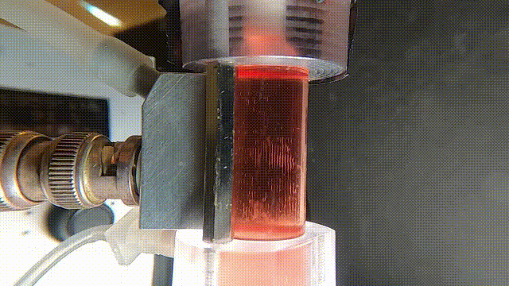
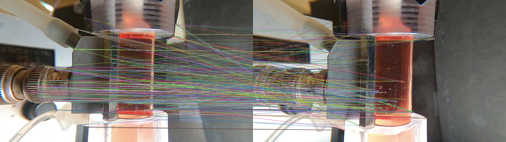
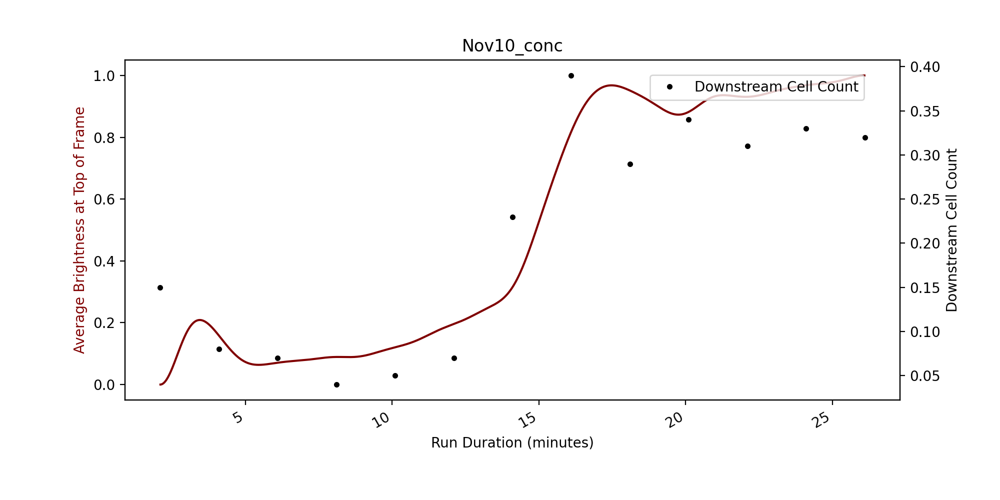
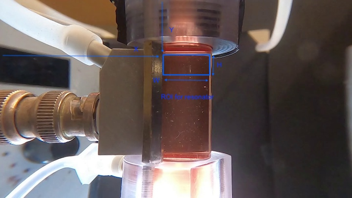

# Cell Resonator

## Overview

This repo uses image analyis to predict cell losses in the top of a cell resonator (a device which uses acoustic waves to capture cells so that they may be washed). The average brightness at the top of the resonator (~top 50 pixels) is used to indicate the number of cells passing through the region, and thus, indicate the cell loss. A sample of the resonator footage used to predict cell losses is demonstrated below.




Each time the camera is positioned relative to the resonator, the exact pixel coordiantes of the top of the resonator changes, thus the images need to be calibrated. ORB (Oriented FAST and Rotated BRIEF) features are detected in the target and a reference video of the resonator, the homography is calculated and the target video is warped frame-by-frame to match the coordinates of the first video. The ORB feature matches between a reference and target video are shown below: 



Once the videos are matches, the average resonator intensity is extracted as a csv file and the histograms are plotted alongside the ground-truth data extracted from downstream live cell counts and a resistance sensor. An example of the pipeline's output is shown below:

 

## Usage

### 1. Running the pipeline

#### Docker

In order to use this app from docker, you need to ensure that you have [Docker](https://www.docker.com/products/docker-desktop) installed. Once it is installed, move inside of this directory (CellResonator) from the command line and run the following commands: 

Building the image:

```bash
docker build -t resonator-pipeline .
```

Creating a container (making sure to replace the path to data with your path, this creates a mount between your host machine and the docker container path):

```bash
docker run --name resonator-container -it -v "path/to/data":/home/app_user/data_mount resonator-pipeline
```

The following command will open up a bash shell from inside of your docker container, and you can run the following command (DO NOT change the path indicated below)

```bash
python -m main -i /home/app_user/data_mount
```

Once the command is done running, and you have verified that your results have been produced, you can exit the container bash using

```bash
exit
```

And remove the docker container using 

```bash
docker rm resonator-container
```


#### Python 

1. Move the following files in a single folder:

* Excel sheet from template described in docs
* Videos (any of the following)
    * 1 conc / wash video
    * Total video (conc + wash in 1 video) 
    * 2 videos, conc and wash

2. Install requirements from terminal/command line using

```bash
pip install -r requirements.txt
```

(make sure you are inside the CellResonator directory when doing this)

3. Run the package from terminal/command line using

```bash
python -m main -i "path/to/folder/with/data" 
```

Where the path is replaced with the appropriate path to the data folder, and num_files corresponds to the number of video files to process. The script will run and produce the histograms indicated above.

### 2. Running a workflow

#### Workflow 1 

Workflow 1 was created to run the brightness algorithm on the top of the resonator video for any length of video and output an xlsx file in the 'results' folder which has the from the start of the video and the average brightness in the top of the resonator. In order to run this workflow in either docker or python, follow all the instructions provided above expect for the portion with the python command. Instead of running

```bash
python -m main -i "path/to/folder/with/data"
```

for python, or 

```bash
python -m main -i /home/app_user/data_mount
```

for docker, run this command instead:

```bash
python -m main -i "path/to/folder/with/data" -t "workflow1"
```

for python, or for docker run:

```bash
python -m main -i /home/app_user/data_mount -t "workflow1"
```

## Dependencies

Cell Resonator requires:

### Environment
* os -> mac, windows, linux
* python > 3.8.3
* pip > 21.3.1

### Packages
* pandas==1.0.5
* seaborn==0.11.1
* scipy==1.4.1
* numpy==1.19.5
* matplotlib==3.2.2
* opencv_python==4.5.1.48
* moviepy==1.0.3
* python-dotenv==0.19.2
* scikit_learn==1.0.2
* click==8.0.3

Install requirements using:
```bash
pip install -r requirements.txt
```

## Testing

Testing is done using python package pytest. In order to test, need to be on mac and run the following:
```bash
pip install pytest

pytest tests
```

## Re-configuring the pipeline

The pipeline is built upon many variables which were selected through trial and error as the best possible configuration. All of these variables are accessible inside of the .env file in this directory, under the header "CONFIGURATION VARIABLES". I will go briefly over the purpose of each of these here, in the case that you would like to change them in the future. 

1. SLICE_FREQ

When the sliced csv is produced from the raw video data, every SLICE_FREQ frames are averaged, and the average is output to the sliced csv file, which is used to create the plots and the xlsx file. This defaults to 5, but could realistically be changed to anything as low as 1 and as high as 25. It is there to reduce noise. 

2. TIME_CORRECT

There is a time delay of ~50 seconds between the resonator chamber and the output sensor. If this distance changes, or the average flow rate in the connecting tube changes, this value will need to be changed. 

3. GAUSS_STD

When the resonator data is plotted for visualization, a gaussian filter is added to mimic the effect of down-stream dispersion which will occur to cells traveling through the silicon tube leading out of the resonator. This defaults to 60, however can be changed without harm.

4. WIN_TOP & WIN_BOTTOM 

The brightness algorithm is applied to the top fraction of the resonator. This region is typically 0 - 25 pixels from the top of the region of interest indicated in the section below this. That said, this can depend upon many things, and should be configured in the future. 

## Reset Basis Image

The majority of this pipeline is built off of a [single reference image](data/basis.jpg) stored in data. It is very likely that if the setup of the camera or resonator is changed significantly, this pipeline will no longer work. To change the basis so that the pipeline works, one must change the basis photo and the coordinates of the resonator in the .env file. The meaning of coordinates X, Y, H and W are shown below. 



To reset the basis image, a new basis video needs to be selected, and the coordiantes of the new ROI drawn on top. To run this module, please run the following command from the command line:

```bash
python -m reset -i path/to/newbasisvideo.mp4
```

Alternatively, you can also just use the folder in which the video is stored. If there is more than 1 video, it will select the first and return it. 

```bash
python -m reset -i path/to/newbasisvideofolder/
```

This will first extract the 100th frame of the video as the basis image, create an interactive window where you can change the basis image and change the coordinates in the .env file. Please draw the ROI according to the sample image provided above. In order to reset all drawn ROI's on the image, right click on the interactive window. To exit and save the latest ROI, press Q. Note that this does not delete the latest basis image. It will rename it using the lowest integer possible (i.e. basis0.jpg), given that it won't overwrite another image. 

_Note that this has not yet been adapted to work in Docker_


## Re-calibrating the Brightness Algorithm

Calibration is used to create a linear regression model which can relate the absolute pixel brightness inside of the resonator to the downstream cell count. Note that calibration will only work when there is >100 frames of the resonator with just media at the start of the video, so it doesn't currently work for washing. The absolute brightness in the environment can change slightly when using the brightness calibration curve, as the background brightness in the chamber is subtracted first. To use, you will first need to run the pipeline and create the xlsx data sheets as shown in data/calibrate/sample_data. If you don't have any sample data and want to calibrate anyways, you may try using this data as an example. The pipeline should work on both docker and from the CLI. It will reset the linear regression model inside of the .env file and create a regression png stored in data/calibrate/results, as shown below:


```bash
python -m calibrate -i path/to/data
```

Alternatively, you may run from docker using all the steps outlined for main, except run the following command instead:

```bash
python -m calibrate -i /home/app_user/data_mount
```


## Help/Troubleshooting

For more information, or to report a bug, email developer at riley.ballachay@gmail.com