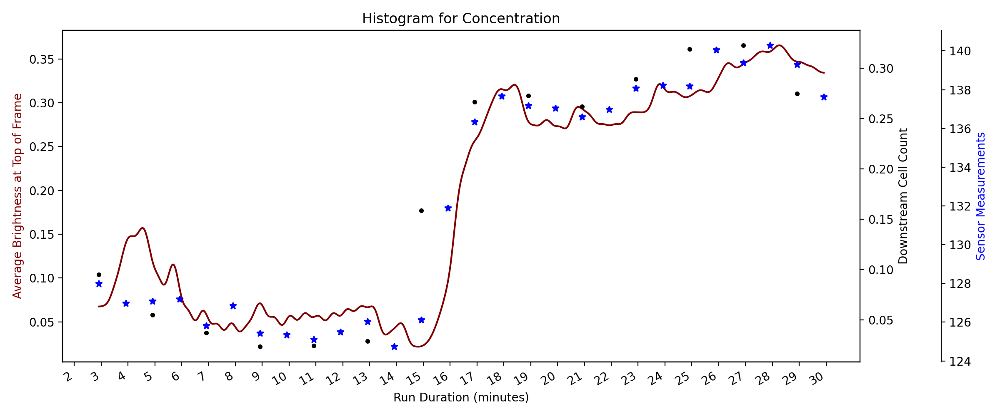

# Cell Resonator

## Overview

This repo uses image analyis to predict cell losses in the top of a cell resonator (a device which uses acoustic waves to capture cells so that they may be washed). The average brightness at the top of the resonator (~top 50 pixels) is used to indicate the number of cells passing through the region, and thus, indicate the cell loss. A sample of the resonator footage used to predict cell losses is demonstrated below.


Each time the camera is positioned relative to the resonator, the exact pixel coordiantes of the top of the resonator changes, thus the images need to be calibrated. ORB (Oriented FAST and Rotated BRIEF) features are detected in the target and a reference video of the resonator, the homography is calculated and the target video is warped frame-by-frame to match the coordinates of the first video. The ORB feature matches between a reference and target video are shown below: 


Once the videos are matches, the average resonator intensity is extracted as a csv file and the histograms are plotted alongside the ground-truth data extracted from downstream live cell counts and a resistance sensor. An example of the pipeline's output is shown below:

 

## Usage

### 1. Running the pipeline

#### Docker

In order to use this app from docker, you need to ensure that you have [Docker](https://www.docker.com/products/docker-desktop) installed. Once it is installed, move inside of this directory (CellResonator) from the command line and run the following commands: 

Building the image:

```bash
docker build -t resonator-pipeline .
```

Creating a container (making sure to replace the path to data with your path, this creates a mount between your host machine and the docker container path):

```bash
docker run --name resonator-container -it -v "path/to/data":/home/app_user/data_mount resonator-pipeline
```

The following command will open up a bash shell from inside of your docker container, and you can run the following command (DO NOT change the path indicated below)

```bash
python -m main -i /home/app_user/data_mount
```

Once the command is done running, and you have verified that your results have been produced, you can exit the container bash using

```bash
exit
```

And remove the docker container using 

```bash
docker rm resonator-container
```


#### Python 

1. Move the following files in a single folder:

* Excel sheet from template described in docs
* Videos (any of the following)
    * 1 conc / wash video
    * Total video (conc + wash in 1 video) 
    * 2 videos, conc and wash

2. Install requirements from terminal/command line using

```bash
pip install -r requirements.txt
```

(make sure you are inside the CellResonator directory when doing this)

3. Run the package from terminal/command line using

```bash
python -m main -i "path/to/folder/with/data" 
```

Where the path is replaced with the appropriate path to the data folder, and num_files corresponds to the number of video files to process. The script will run and produce the histograms indicated above.

### 2. Running a workflow

#### Workflow 1 

Workflow 1 was created to run the brightness algorithm on the top of the resonator video for any length of video and output an xlsx file in the 'results' folder which has the from the start of the video and the average brightness in the top of the resonator. In order to run this workflow in either docker or python, follow all the instructions provided above expect for the portion with the python command. Instead of running

```bash
python -m main -i "path/to/folder/with/data"
```

for python, or 

```bash
python -m main -i /home/app_user/data_mount
```

for docker, run this command instead:

```bash
python -m main -i "path/to/folder/with/data" -t "workflow1"
```

for python, or for docker run:

```bash
python -m main -i /home/app_user/data_mount -t "workflow1"
```


## Dependencies

Cell Resonator requires:

### Environment
* os -> mac, windows, linux
* python > 3.8.3
* pip > 21.3.1

### Packages
* pandas==1.0.5
* seaborn==0.11.1
* scipy==1.4.1
* numpy==1.19.5
* matplotlib==3.2.2
* opencv_python==4.5.1.48
* moviepy==1.0.3
* python-dotenv==0.19.2
* scikit_learn==1.0.2
* click==8.0.3

Install requirements using:
```bash
pip install -r requirements.txt
```

## Testing

Testing is done using python package pytest. In order to test, need to be on mac and run the following:
```bash
pip install pytest

pytest tests
```

## Help/Troubleshooting

For more information, or to report a bug, email developer at riley.ballachay@gmail.com
